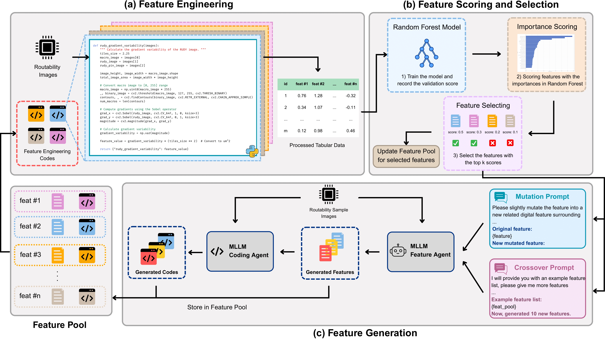

# **Multimodal Chip Physical Design Engineer Assistant**

**TL;DR:** We propose MLLMA, a multimodal LLM assistant that predicts chip design congestion maps and offers interpretable guidance for layout optimization.


<p>Overview of the interpretable preference modeling framework. The multimodal architecture integrates layout images and task prompts, predicts feature values, learns objective weights via a gating mechanism, and generates both scalar congestion scores and spatial congestion maps. This enables transparent and actionable feedback for physical design refinement.</p>

## Performance


## Setup

### Install Required Packages
Run the following commands to install the requirements:
```bash
conda create -n mllma python=3.10
conda activate mllma
pip install -r requirements.txt
```

### Prepare Dataset

Download CircuitNet-N28 dataset follow the guide of [CircuitNet](https://github.com/circuitnet/CircuitNet).

## Automated Feature Generation and Engineering


<p>Overview of the Genetic Instruct framework. (a) Spatial metrics are extracted from routability images using domain-specific rules. (b) A Random Forest ranks and select key features. (c) MLLM agents iteratively generate and mutate features via code, enriching the feature pool to improve downstream performance.</p>

### Run the Pipeline for Interpretable Features

If you want to generate new interpretable features for the next stage training, you can choose one of the below scripts in different pipelines:

- For the **Genetic Instruct pipeline**, please refer to `Congestion/feat_extract/genetic_feature_extract.ipynb`.

- For the **Crossover-Only pipeline**, please refer to `Congestion/feat_extract/genetic_feature_extract.ipynb`.

- For the **Mutation-Only pipeline**, please refer to `Congestion/feat_extract/genetic_feature_extract.ipynb`.

### Generated Features Evaluation 

To evaluate the generated features from the above pipelines, you should first create a python file `feature_extract_func.py`, containing feature pool and all feature engineering functions. The example format is in `Congestion/feat_extract/feature_extract_func.py`, You can simply replace the variables and generated functions in it.

You can use the following command:
```bash
python Congestion/feat_extract/eval_features.py \
    --device <your_device> \
    --pretrained <GPDL_baseline_model_path> \
    --feature_path <circuitnet_image_features_path> \
    --label_path <circuitnet_label_path> \
    --save_path <img_save_path> \
```

This command will evaluate the features you generated in `feature_extract_func.py` with the testing sets. You can turn on the baseline by simply adding `--baseline` to compare your features with the GPDL model.

## Congestion Map Prediction

### Dataset Preparation

Please refer to `Congestion/feat_extract/dataset_preparation.ipynb` before starting the below stages.

### Stage-1 Regression Layer Training

To train the regression layer with the collected interpretable features as labels, please use the following commands:


```bash
# Preparation for MLLM last hidden states
python Congestion/stage-1/stage-1_prepare.py \
    --device <your_device> \
    --dataset_path <./dataset/train_df.csv>

# Regression layer Training
python Congestion/stage-1/stage-1_train.py \
    --device <your_device> \
    --embeddings_dir <hidden states path to train with> \
    --output_dir <regression weights saving path>
```


### Stage-2 Gating Layer Training

To train the gating layer (MLP) in in the manner of reward model training, please use the following commands:

```bash
# Preparation for MLLM hidden states with special token
python Congestion/stage-2/stage-2_prepare.py \
    --device <your_device> \
    --dataset_path <./dataset/preference_df.csv>

# Gating layer Training
python Congestion/stage-2/stage-2_train.py \
    --device <your_device> \
```

### Stage-3 Generation Module Training

To train the generation module (Unet2D), please use the following commands:

```bash
# Preparation for Unet2D Condition (feature descriptions)
python Congestion/stage-3/stage-3_prepare.py \
    --device <your_device> \
    --regression_layer_path <stage-1 regression weights>
    --gating_network_path <stage-2 gating weights>
    --dataset <(1) training: ./dataset/train_df.csv (2) testing: ./dataset/test_df_a(b).csv>

# Unet2D Training for congestion map generation
python Congestion/stage-3/stage-3_train_text.py \
    --device <your_device> \
    --unet_path <your unet pretrained path (default: sd35)> \
    --text_encoder_path <your text encoder path (default: sd35)> \
    --dataset <dataset from stage-3_prepare.py> \
```

### Evaluation

For the evaluation pipeline, you must first generate the testing description files from the `stage-3_prepare.py` in testing mode. Then run the following commands:

```bash
python Congestion/eval/eval_congestion_text.py \
    --device <your_device> \
    --decoder_path <checkpoint from stage-3>
```
